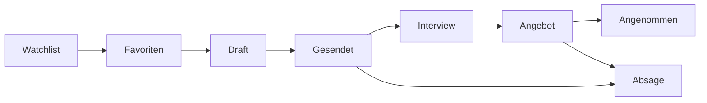

# JobFlow

**Bewerbungen strukturiert verwalten — vom ersten Interesse bis zur Zusage.**

JobFlow ist eine Multi-User-Webanwendung (SPA), die den gesamten Bewerbungsprozess übersichtlich visualisiert. Statt Tabellen und Tab-Chaos hast du alle Bewerbungen, Unternehmen, Ansprechpartner und Dokumente an einem Ort und immer den Überblick darüber, wo du gerade stehst.

---

## Features

| Feature                    | Beschreibung                                                               |
| -------------------------- | -------------------------------------------------------------------------- |
| **Job-Kategorisierung**    | Stellen vor dem Bewerben priorisieren (Watchlist / Favoriten)              |
| **Aufgaben**               | Unteraufgaben pro Bewerbung mit eigenem Status (Todo → In Progress → Done) |
| **Unternehmen & Kontakte** | Firmen und Ansprechpartner verwalten und mit Bewerbungen verknüpfen        |
| **Dokumente**              | Lebenslauf, Anschreiben, Zeugnisse hochladen und Bewerbungen zuordnen      |
| **Multi-User**             | Jeder Nutzer sieht ausschließlich seine eigenen Daten                      |

### Optionale Features

| Feature          | Beschreibung                                                       |
| ---------------- | ------------------------------------------------------------------ |
| **Kanban-Board** | Bewerbungen mit vollständigem Status-Workflow visualisiert         |
| **Profil**       | Persönlicher Baukasten — Lebenslauf-Bausteine, Foto, Standardtexte |

### Bewerbungs-Workflow



---

## Tech-Stack

| Bereich      | Technologie                                                         |
| ------------ | ------------------------------------------------------------------- |
| **Runtime**  | Node 24 (nativer TypeScript-Support via `--strip-types`)            |
| **Backend**  | Express 5, Mongoose, Zod, JWT, Multer                               |
| **Frontend** | React 19, Vite, React Router v7, Zustand, shadcn/ui, Tailwind CSS 4 |
| **Shared**   | Zod-Schemas + TypeScript-Types (kein React, kein Framework)         |
| **Testing**  | Vitest (alle drei Packages)                                         |
| **Monorepo** | pnpm workspaces                                                     |

---

## Architektur

Das Projekt ist als **pnpm-Monorepo** mit drei Packages aufgebaut:

```
shared/    # Zod-Schemas, TypeScript-Types, Konstanten
backend/   # Express 5 REST API
frontend/  # React 19 SPA, Vite, shadcn/ui, Zod, TypeScript
```

Das `shared`-Package ist der gemeinsame Vertrag zwischen Backend und Frontend: Zod-Schemas werden einmal definiert und auf beiden Seiten verwendet — für die Formularvalidierung im Browser und für die Request-Validierung auf dem Server. Kein Build-Schritt nötig, beide Consumer lesen TypeScript-Source direkt.

**Sicherheit:** JWT mit Access Token (15 min, nur im Memory) und Refresh Token (7 Tage, httpOnly Cookie mit Rotation). Jede API-Antwort ist hart an die User-ID gebunden — kein Nutzer sieht fremde Daten.

---

## Setup

### Voraussetzungen

- Node 24+
- pnpm 9+
- MongoDB (lokal oder Atlas)

### Installation

```bash
git clone <repo-url>
cd jobflow
pnpm install
```

### Umgebungsvariablen

```bash
cp backend/.env.example backend/.env
```

### Starten

```bash
pnpm dev        # Frontend (Port 5173) + Backend (Port 3001) parallel
pnpm test       # Vitest in allen Packages
pnpm typecheck  # TypeScript-Check in allen Packages
```

## Projektverwaltung

Die Projektverwaltung wird mit **github Projects** koordiniert und ist unter folgendem Link zu finden:
[JobFlow Projektplan](https://github.com/users/sascha-mueller/projects/1)
