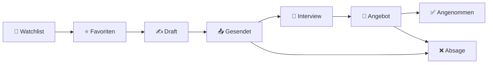

# JobFlow — Elevator Pitch

## Kernaussage (2 Minuten)

Stell dir vor, du bewirbst dich auf 20 Stellen gleichzeitig.
Irgendwo läuft ein Interview, irgendwo wartest du auf Rückmeldung, irgendwo hast du schon längst absagen wollen — und du verlierst den Überblick. Eine Excel-Tabelle hilft, aber sie fühlt sich nicht so an.

**JobFlow löst genau das.**

Es ist eine Bewerbungsverwaltung, die alle offenen Bewerbungen in einem Kanban-Board visualisiert — von der ersten Idee bis zum Angebot oder der Absage. Du siehst auf einen Blick, wo du stehst. Du verknüpfst Unternehmen, Ansprechpartner und Dokumente direkt mit deiner Bewerbung. Kein Zettelchaos, kein Tab-Switching.

Bevor du dich überhaupt bewirbst, sammelst du Jobs — und JobFlow hilft dir, sie zu bewerten: Ist diese Stelle nur interessant, oder will ich mich auf jeden Fall bewerben? Mit einem einfachen Kategorie-System behältst du auch deine Pipeline im Blick, nicht nur den aktuellen Stand.

JobFlow kennt nicht nur deine Bewerbungen — **es kennt auch dich**: Lebenslauf-Bausteine, Foto, Standardformulierungen. Alles an einem Ort, abrufbar wenn du es brauchst.

Was das Projekt technisch interessant macht: Es ist als Monorepo gebaut, mit einem gemeinsamen Paket für Datentypen und Validierungslogik — die gleiche Regel, die der Server prüft, prüft auch das Formular im Browser. Das ist kein Zufall, das ist Architektur.

Und der eigentliche Clou: Dieses shared-Package ist so gebaut, dass es wiederverwendet werden kann. Die Aufgaben innerhalb einer Bewerbung — Anschreiben schreiben, Probe-Aufgabe abgeben, Feedback nachfassen — folgen derselben Struktur wie Aufgaben in einem Projekt. Der nächste Schritt ist eine Projektverwaltung. Die Infrastruktur dafür steht bereits.

---

## Feature-Highlights

| Feature          | Beschreibung                                                                                                           |
| ---------------- | ---------------------------------------------------------------------------------------------------------------------- |
| **Kanban-Board** | Bewerbungen mit Status-Workflow visualisiert (Watchlist → Favoriten → Draft → Gesendet → Interview → Angebot → Absage) |



| **Job-Kategorisierung** | Priorisierung vor dem Bewerbungsprozess (Interessant / Will ich mich bewerben) |
| **Aufgaben** | Unteraufgaben pro Bewerbung mit eigenem Status (Todo → In Progress → Done) |
| **Unternehmen & Kontakte** | Firmen und Ansprechpartner verwalten, mit Bewerbung verknüpfen |
| **Dokumente** | Lebenslauf, Anschreiben, Zeugnisse hochladen und zuordnen |
| **Profil / Eigene Daten** | Lebenslauf-Rohdaten, Foto, Standardtexte — persönlicher Baukasten für Bewerbungen |
| **Multi-User** | Jeder Nutzer sieht nur seine eigenen Daten |

---

## Technische Highlights (für Fachpublikum)

- **pnpm Monorepo** mit 3 Packages: `client`, `server`, `shared`
- **shared-Package** enthält Zod-Schemas und TypeScript-Types — eine Validierungslogik für Client und Server
- **Node 24** mit nativer TypeScript-Unterstützung (`--strip-types`) — kein Compiler-Build-Schritt für den Server
- **JWT-Sicherheit**: Access Token (15 min) + Refresh Token mit Rotation (httpOnly Cookie, kein localStorage)
- **React 19 + shadcn/ui + Tailwind CSS 4** für das Frontend
- **Wiederverwendbarkeit**: Dieselbe Task-Struktur (Bewerbung → Aufgaben) wird später in der Projektverwaltung wiederverwendet

---

## Der rote Faden

```
Ich kenne mich selbst  →  Profil / eigene Daten
Ich beobachte Jobs     →  Watchlist / Kategorisierung
Ich bewerbe mich       →  Kanban-Workflow
Ich behalte den Faden  →  Aufgaben, Kontakte, Dokumente
Ich skaliere           →  Projektverwaltung (nächster Schritt)
```

---

## Anmerkungen der Gruppe

- Statt PDF erst HTML zu generieren
- Ggf. lokal generieren
